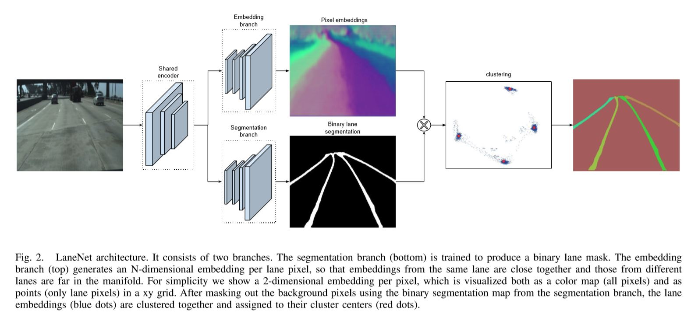
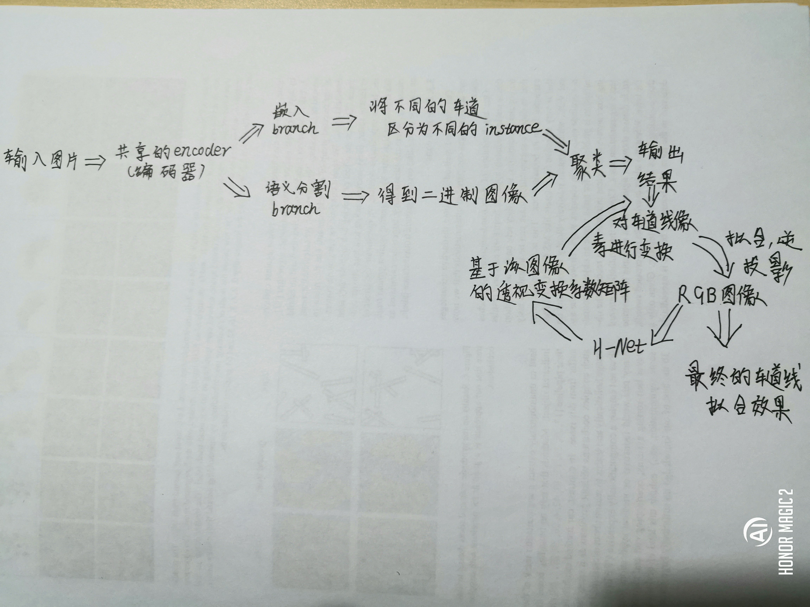

# lane-detection
+ 最近在做车道线检测、分割的工作，读到一篇十分不错的文章对此做下总结
- 首先点名推荐一篇IEEE IV 2018的优秀论文：[《LaneNet: Real-Time Lane Detection Networks for Autonomous Driving》](./1802.05591.pdf)
+ 这篇文章主要解决了车道切换以及车道数的限制的问题
- 实现方法是：通过训练神经网络进行端到端的车道检测，将车道检测作为实例分割问题来实现
+ 文章提出了 Lannet 网络结构，如下图：
 
+ Lanenet 使用一个共享的encoder，对输入图像进行处理，得到2个branch：嵌入branch和语义分割的branch。嵌入branch可以将不同的车道线区分为不同的instance；因为只需要考虑车道线，因此语义分割的结果是二值化图像；然后对2个branch做聚类，最终得到结果
-  通常情况下，车道像素被投影成“鸟瞰图”表示，使用一个固定的转换矩阵。然而，由于变换参数对所有图像都是固定的，所以当遇到非地面时，例如在斜坡上，这会引起一些问题。为了缓解这个问题，文章提出 H-Network，它可以估算输入图像上的“理想”透视变换的参数。

 + 基于学习方法的投影方法H-Net
 
    - 将输入的RGB图像作为输入，使用LaneNet得到输出的实例分割结果，然后将车道线像素使用H-Net输出得到的透视变换矩阵进行变换，对变换后的车道线像素在变化后的空间中进行拟合，再将拟合结果经过逆投影，最终得到原始视野中的车道线拟合结果

    * H-Net将RGB作为输入，输出为基于该图像的透视变换系数矩阵，优化目标为车道线拟合效果
    
+ 论文的整体计算流程图大致如下(草图)所示：
    
  

- 说到这篇端到端的车道线检测，不得不提的是这篇文章中用到的一个聚类loss，同样是这篇文章的作者发表的一篇文章[《Semantic Instance Segmentation with a Discriminative Loss Function》](./1708.02551v1.pdf)
